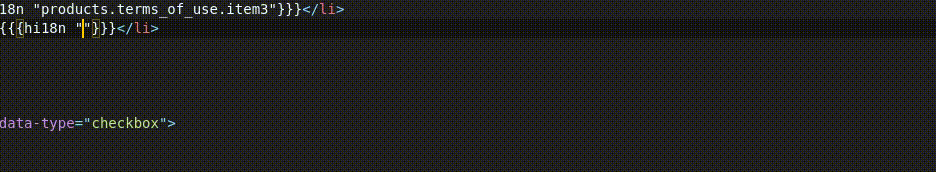

# labels-finder

A extension to find api-languages labels.

## Extension Settings

Create a file named "labelsFinder.json" at the root of your project and add the properties "labelsPath" (path of your language file) and "documentSelector" (type of files to applicate autocomplete).

```
{
    "labelsPath": "src/language/pt_BR.json",
    "documentSelector": ["javascript", "typescript", "html"]
}
```


